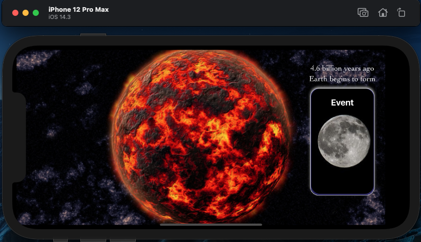
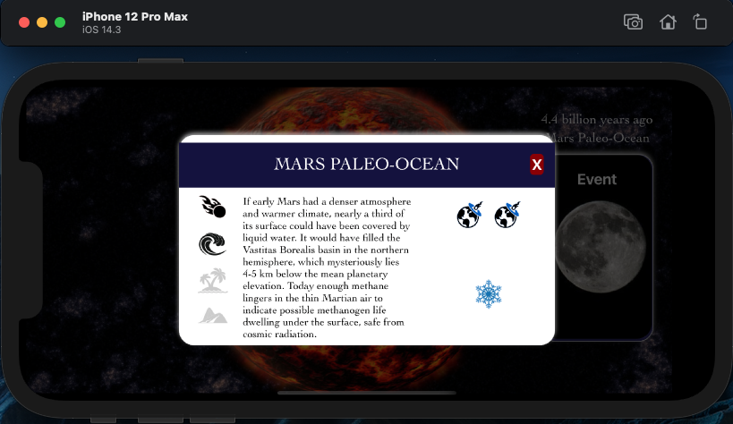
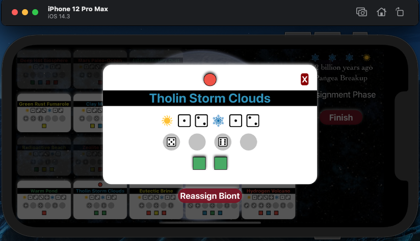
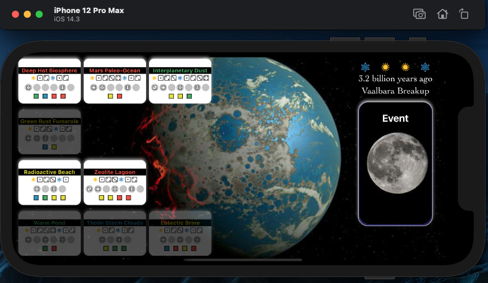
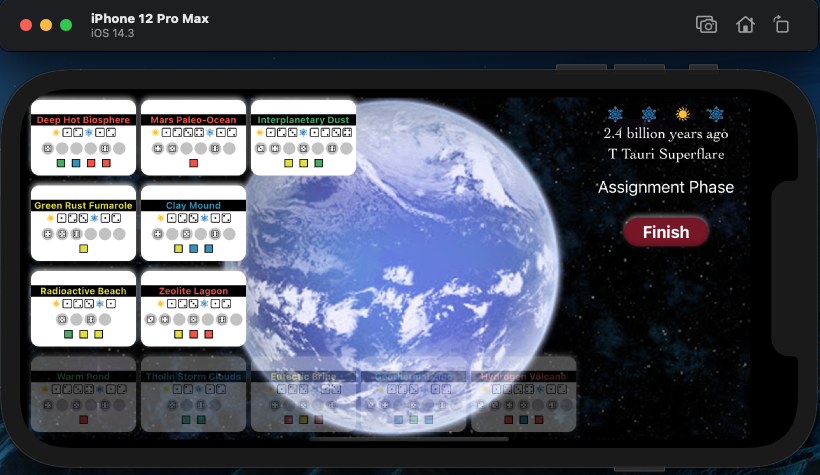
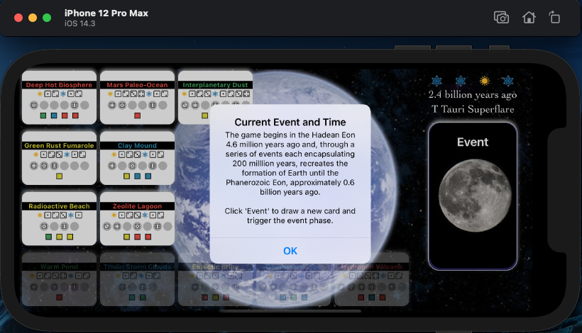
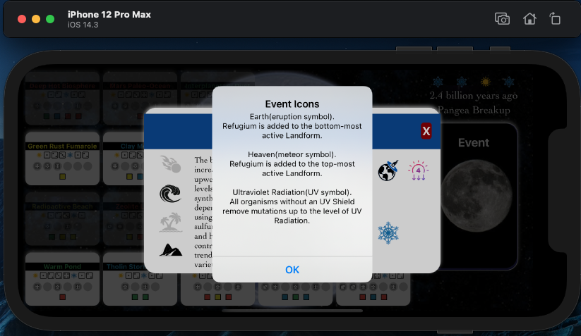

## BioGen

A digital version of the board game Bios: Genesis - a simulation of the creation of life following the formation of the Earth 4 billion years ago.  
  

Draw events to create new landforms and throw obstacles to life gaining a foothold.  

Assign your biont where they stand the best chance of thriving and rely on the roll of the dice.  
  

As time progresses, more opportunities for life begin to appear, but can also disappear when weakened or destroyed by events.  
  
  

Alerts offer further information by clicking on in game icons.  
  
